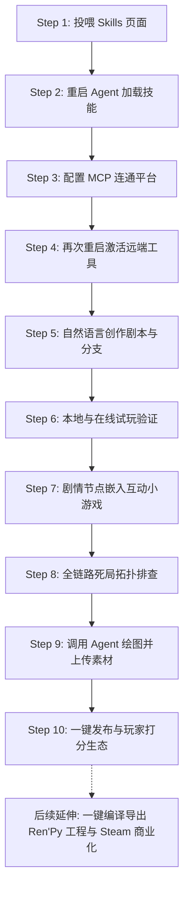

# 用全模态 AI Agent 打造互动游戏书：从安装 Skills 到生图发布的全流程实战

你是否曾经历过这样的时刻：脑海中有一个极具张力的悬疑故事、一段错综复杂的跑团模组，或者几个截然不同的命运抉择，但在想要把它做成可以交互的游戏时，却被繁琐的引擎学习成本、复杂的脚本语法、高昂的美术音乐预算劝退，最终只能任由绝妙的创意躺在备忘录里蒙尘？

传统视觉小说（Visual Novel）与文字冒险游戏（AVG）的制作门槛，长期困扰着以文字和剧情见长的创作者。即便市面上有成熟的游戏引擎，为每一个分支绘制流程图、处理逻辑跳转和变量判定，依然是一项让人心智疲惫的重体力活。

随着全模态大模型与 AI Agent（智能体）技术的成熟，这一局面正在被彻底改写。「姆伊游戏书（MUI Gamebook）」将互动游戏的开发全链路拆解为可被 Agent 调度的标准化 Skills，让文字创作者不仅能用自然语言推演剧情，还能让 Agent 现场手搓解谜小游戏、做编译器级的死局检测，并在最后调用自带的生图工具完成全套视觉包装。

本文将为你梳理一套直达 90 分的完整工业化创作流：从技能安装、环境连接、剧本创作、解谜小游戏嵌入、死局体检，到全模态绘图与最终一键发布，只需 10 个步骤即可完成。

## 💡 为什么必须选择全模态 AI Agent？

在开启教程前，必须先明确一个至关重要的工具选型前提：

制作互动游戏书不是纯粹的代码开发，它是一门融合了文字叙事、逻辑变量分支、角色立绘配图、甚至动态视频与音效的综合视听艺术。

因此，像 OpenCode 这类专注于终端敲代码、缺乏多媒体生成与视觉渲染能力的纯编程 Agent，并不适合用来做游戏创作。我们强烈建议选用原生内建多模态生成管线的顶级 AI Agent 客户端：

- **Google Antigravity**：谷歌顶尖的智能体开发环境，具备深度自主任务编排与原生生图渲染工具链，非常适合驾驭全流程自动化创作；
- **Codex**：生态极其成熟，对多模态设计与长程上下文记忆有极高宽容度，适合大体量网状叙事；
- **小米 Mimo（Mimocode）**：本土化体验优秀，自带全模态生成与丰富的插件生态；
- **WorkBuddy**：腾讯出品的专业智能体工作台，对创作者与跨模态图像视听生成有着天然友好的支持。

选用上述全模态 Agent，才能在后续的创作管线中实现“写完剧本直接让 Agent 调起画笔生图上传”的无缝闭环。

## 💡 灵魂之问：为什么不直接让 AI 写 Ren'Py，而是在姆伊故事书上创作？

很多熟悉视觉小说开发的创作者会下意识提出一个疑问：既然现在大模型这么聪明，我为什么不直接让 AI 帮我写 Ren'Py 的 Python 脚本，而要选择在姆伊故事书（muistory.com）上创作？

这背后涉及到创作迭代效率、AI 幻觉控制与传播转化的根本性差距。姆伊故事书并非排斥 Ren'Py，而是作为它的**现代化敏捷生产力前端**。两者的核心价值对比如下：

1. **零环境配置纯浏览器驱动，手机平板随时创作与畅玩**：
使用 Ren'Py 往往需要下载几个 G 的 SDK 安装包，配置复杂的 Python 运行时环境与专用编辑器；若想导出移动端包体，还得折腾 Java JDK、SDK 与签名证书，门槛极其高耸。而姆伊故事书完全运行在浏览器中，真正做到了零安装、零配置环境。无论是 Windows、Mac，还是 iPad 平板乃至手机，随时随地打开浏览器就能读、写、测。创作者在通勤路上掏出手机就能微调剧本，身边的朋友掏出手机点开就能即刻体验。

2. **秒级线上预览与极速朋友试玩，拒绝动辄几百兆打包**：
在传统引擎中，每写完一段剧情想要找朋友试玩，你必须先在本地打包成几百兆的压缩包（Windows EXE 或 Android APK）。朋友往往因为解压繁琐、手机无法安装或电脑报毒而放弃测试。而在姆伊故事书中，你随时生成一个网页短链接发到微信或群聊，朋友在手机或电脑浏览器点开就能秒玩，反馈收集效率提升百倍。

3. **完成后支持一键编译导出到 Ren'Py 等主流平台**：
在姆伊故事书上创作，不代表你放弃了桌面单机发行。姆伊的底层 DSL 是高度结构化的标准资产，当你在这套工作流中完成了剧本推演、变量平衡与试玩验证后，未来可以直接一键编译导出为标准的 Ren'Py 脚本工程与桌面包，无缝衔接后续的 Steam 上架。

4. **天然的商业化试玩版（Demo 获客利器）**：
即使你的终极目标是在 Steam 卖商业独立游戏，网页版也是转化率最高的前哨阵地。玩家不需要先在 Steam 上下载几十分钟的独立 Demo，直接在社交媒体、B 站或论坛点开网页就能试玩精彩前三章，试玩结束后一键引导跳转 Steam 加入愿望单，获客转化率呈数量级提升。

5. **轻量 Markdown DSL 降维打击脆弱的 Python 缩进**：
让 AI 直接手写 Ren'Py，本质上是在写 Python 脚本。随着剧情分支增多，AI 极易在复杂的 label、jump、call、screen 语法和缩进层级中产生严重幻觉，改动一处往往导致其他十处语法报错。而姆伊采用直观的 Markdown 语法，这是大语言模型最擅长、最不易产生幻觉的原生格式，Token 消耗仅为 Python 脚本的几分之一，维护极其稳固。

6. **确定性的“编译期死局体检”，告别实机踩雷闪退**：
Ren'Py 自身缺乏静态全图拓扑排查机制。如果作者笔误写错了一个跳转目标，或者某个隐藏选项要求的变量数值在游戏中根本无法达成，Ren'Py 在打包时是完全不报错的，只有等到玩家实机打到那一步才会突然闪退卡关。姆伊内置了类似编译器的 validate-game 静态分析工具，能在创作阶段遍历所有分支，100% 保证剧情逻辑严丝合缝。

7. **即插即用的现代 Web 交互，零门槛嵌入解谜小游戏**：
想在 Ren'Py 里做拼图、字符密码机或 QTE，必须使用 Ren'Py 繁复的 UI 布局配合 Pygame 底层手搓，在移动端触控体验极差。而在姆伊基于现代 Web 技术的框架下，AI 可以直接生成轻量优雅的 HTML5 互动游戏组件，在手机与 PC 端丝滑运行，并将胜负结果无缝回传剧情。

8. **开箱即用的真实玩家评价与种子社区沉淀**：
单机安装包发出去后是一个信息黑盒，创作者很难知道读者玩得爽不爽。姆伊原生内置了结局五星打分、感悟长评、未登录自动缓存与作者置顶后台。从创作第一天起，你就在直接积累作品的真实玩家口碑与早期的铁杆拥趸。




*图 1：姆伊游戏书网页播放器实机体验——纯浏览器驱动、零环境依赖，精美立绘与状态属性一览无余*

## Step 1：把 Skills 页面丢给 AI Agent，完成全套技能安装

过去使用各类开发框架，创作者往往要在命令行里复制一段又一段神秘代码，或者反复去 GitHub 下载各种配置文件。在姆伊游戏书中，这个过程被简化到极致。

你只需要打开浏览器访问 [姆伊游戏书技能中心](https://muistory.com/skills)，然后把这个网址直接发给你的全模态 AI Agent：

```text
请阅读 https://muistory.com/skills 页面内容，了解姆伊游戏书的全套创作者技能规范，并帮我把所有对应的 Skill 文件下载并安装到当前工作区的 .agents/skills/ 目录下。
```

Agent 会自动抓取网页结构，精准定位到环境配置（setup）、剧本创作（create-game）、小游戏生成（create-minigame）、剧本升级（upgrade-game）以及逻辑体检（validate-game）的所有规范，并在本地目录树中规整就绪。


*图 2：只需将技能中心网址丢给 Agent，即可全自动抓取并安装 5 大标准化技能包*

## Step 2：重启 AI Agent 或开启新对话

Skill 本质上是给 AI Agent 的系统级指令与工作法扩充。

当本地 Skill 文件下载就绪后，客户端通常需要重新构建上下文索引。此时请直接**重启 AI Agent 客户端，或者关闭当前窗口开启一个全新的对话会话**。

开启新会话后，可以通过向 Agent 询问确认技能状态：
```text
请列出当前工作区中已经加载的 mui-gamebook 技能包。
```
当 Agent 准确回答出五大技能包的名称与用途时，说明大脑升级已经就绪。

## Step 3：配置 MCP，连接姆伊故事书服务器

拥有了技能包还不够，Agent 需要能够直接读取你的项目空间并向云端同步剧本，这依赖于跨进程通信的标准协议——MCP（Model Context Protocol）。

在对话框中唤醒第一项配置技能：
```text
请使用 mui-gamebook-setup 技能，帮我完成与 muistory.com 平台的连接配置。
```

Agent 会指导你完成以下操作：
1. 引导你前往 muistory.com 控制台生成个人专属 API Key；
2. 自动在本地写入或更新 `mcp_config.json` 配置文件；
3. 执行连通性测试，确认鉴权凭据与远程端点响应正常。

整个过程创作者无需手动修改任何 JSON 格式，Agent 会全自动搞定环境粘合。

## Step 4：再次重启或开启新对话，激活远端 MCP Tools

在 MCP 配置文件写入后，大部分智能体客户端（如 Google Antigravity、Codex、WorkBuddy）需要重新初始化工具注册表。

再次**重启客户端或新开一个对话窗口**。此时在 Agent 的工具库（Tools）面板中，你会看到一系列以远程游戏书平台为目标的专用能力，包括剧本读写、素材查询、云端预检等。至此，你的 AI Agent 已经成为一名完全连接了云端游戏引擎的专业游戏制作人。


## Step 5：使用自然语言创作剧本与分支网

现在，你可以把任何脑海里的故事丢给它了。不需要懂任何编程语言，也不需要去学类似 Ren'Py 那种复杂的脚本，你只需要像和资深剧情策划聊天一样给出你的初始构思：

```text
请调用 create-game 技能，我想创作一部以雨夜侦探为主角的赛博朋克互动小说《霓虹阴影》。
主角在私人诊所里收到了一枚带有防拆自毁装置的未知记忆体，请帮我规划初始世界观、设定理智值（san）与信誉度（reputation）变量，并设计至少三个截然不同的结局走向。
```

`create-game` 技能不会一股脑吐出粗糙的流水账，而是严格遵循严密的编剧工序：
1. **世界观与核心冲突搭建**：确立故事舞台与阵营关系；
2. **主角与核心变量设定**：定义数值增减规则；
3. **主线与结局拓扑收敛**：规划普通结局、坏结局与隐藏真结局；
4. **生成标准 Markdown DSL**：用清晰的场景标题、正文、变量判定（if）与跳转箭头编排全部场景。

```markdown
# 诊所手术台

冷雨敲打着破损的防辐射玻璃，全息招牌的蓝光在积水里泛着油腻的光泽。手术台上躺着那个浑身湿透的仿生人，胸口的散热格栅正发出微弱的蜂鸣。

> status: san = 80, has_decoder = false

* 用便携解码器强行读取记忆体 [if: has_decoder == true] -> [scene:hack_memory]
* 搜寻仿生人随身携带的防尘风衣 -> [scene:search_coat]
* 拔出配枪，呼叫九号街区警备队 -> [scene:call_police]
```

创作者可以随时要求 Agent 对某一段台词进行文笔润色，或者为某一特定分支补充更多探索细节。

## Step 6：本地与在线试玩，验证剧情节奏

剧本初稿完成后，不要直接发给读者，创作者必须亲自试玩以感受文字节奏与选择分支的心理预期。

姆伊游戏书提供了两种测试途径：
- **本地实时预览**：如果使用了本地开发工具，可以通过轻量本地服务实时渲染播放界面，修改 Markdown 文本的同时屏幕即刻热重载；
- **云端私密试玩**：通过 MCP 将剧本暂存为草稿，在 muistory.com 的网页播放器中打开专属私密链接进行点选体验。

在试玩过程中，重点观察：玩家每次做出的抉择是否能得到清晰的文字反馈？数值变化是否合理？分支路线是否能让人产生重玩的欲望？

## Step 7：在关键场景嵌入可玩的独立解谜小游戏

这是将互动小说与传统纯文字阅读彻底拉开差距的关键一步！

如果遇到“破解密码锁”、“解除定时炸弹”或者“刺客潜行 QTE”，纯文字描写往往会让紧迫感大打折扣。此时请呼叫 `create-minigame` 技能：

```text
在主角尝试破解终端机（hack_memory 场景）时，请使用 create-minigame 技能，为这个场景创作一个复古字符风格的跳跃密码破译小游戏。
限制玩家在 30 秒内根据给出的十六进制线索推导 4 位数字密码。
成功则回传 hack_success = true 并进入解密成功支线，失败则回传 alert_triggered = true 并直接扣除 30 点生命值。
```

Agent 会自动为该场景生成符合规范的独立 HTML5 互动游戏组件：
- 零外部黑盒依赖，直接在浏览器沙盒中流畅运行；
- 适配手机触控点击与桌面键盘输入；
- **变量严格双向联动**：小游戏的胜利与失败，直接决定故事接下来的走向。


*图 3：在关键剧情节点一键嵌入独立的 HTML5 解谜小游戏，胜负即刻驱动分支走向*

## Step 8：跑编译器级全链路体检，彻底杜绝死局卡关

写过几十条网状分支的创作者，最害怕的就是“断头路”：某个场景写到一半忘记写出口，某个隐藏结局需要 100 点信誉但全剧本加起来最多只能拿 70 点，或者由于手误将目标场景名字拼错导致游戏直接报错黑屏。

在整部作品定稿前，直接唤起质检守护神 `validate-game`：

```text
请对当前的互动剧本运行 validate-game 全链路逻辑体检，列出所有断头路、不可达场景、变量未定义风险与死循环。
```

Agent 会进行类似编译器的深度拓扑图扫描：
- **孤岛节点检测**：找出那些辛辛苦苦写完但没有任何前置选项能够跳转进去的冗余场景；
- **悬空目标检查**：排查所有指向不存在场景的错别字跳转；
- **死局路径追踪**：分析玩家是否有可能走入无法抵达任何结局的逻辑卡关死胡同；
- **变量一致性审查**：确保所有 if 判定依赖的变量都有合理的初始化与赋值源头。

扫描完成后，Agent 会出具体检报告，并在你的确认下一键自动修复逻辑断点，确保每一位读者都能顺畅通关。


*图 4：validate-game 像代码编译器一样毫秒级扫描全剧情拓扑，确保 0 死局、0 悬空孤岛、100% 可通关*

## Step 9：剧本与逻辑彻底锁定后，调用 Agent 内建绘图功能生成素材并上传

⚠️ **90 分创作者的核心秘诀：绝对不要在刚动笔时盲目生图！**

很多创作者一上来就疯狂生成几十张背景图，结果后面修改大纲时，废弃了一大半图，不仅浪费昂贵的配额与算力，更打乱了创作心流。

**正确的工业化节奏是：在 Step 8 确认剧本逻辑 100% 闭环无误后，再开启美术包装！**

由于你选用的是 Google Antigravity、Codex、小米 Mimo 或 WorkBuddy 这种全模态 Agent，此时你可以直接给它下达批量生图与上传指令：

```text
剧本逻辑已经验证完毕。请提取当前剧本中所有场景的视觉描写，使用你内建的图像生成能力，为核心场景生成统一风格的赛博朋克像素原画背景。
生成完毕后，调用 mui-gamebook MCP 工具将图片上传到云端素材库，并自动将链接回填到 Markdown 剧本对应的媒体引用位置。
```

Agent 会调用它内置的绘画工具（或根据模型自带多模态接口）生成高品质、风格统摄一致的插图，并通过 MCP 自动回填到正文。一部原本质朴的纯文本，瞬间升级为图文并茂的精品游戏书。


*图 5：逻辑验证闭环后，全模态 Agent 批量生成风格统摄一致的场景原画并自动回填到剧本*

## Step 10：一键发布，享受读者打分与社区长评

一切大功告成，通知 Agent 执行发布：
```text
请将当前剧本正式同步并发布到 muistory.com。
```

几秒钟内，系统会自动生成跨平台自适应的独立网页链接：
- **零下载门槛**：微信、QQ、手机浏览器或 PC 浏览器点开即玩；
- **结局打分组件（RatingWidget）**：读者通关任意结局后，可直接在终局界面给出 1 到 5 星评分并留下通关感言。就算读者未登录，评价也会暂存在本地，登录后静默提交，绝不丢失一条深度反馈；
- **创作者专属管理后台**：创作者可以在后台查阅评分走势、留言列表，并一键把写得深刻的玩家长评置顶在作品主页；
- **社交分享卡片**：自动提炼专属 OpenGraph 卡片，分享出去更有排面。


*图 6：通关后读者可实时给出五星好评与长评留言，作者可在后台置顶精彩神评*

## 结语：让好创意立即变成好游戏

从一段备忘录里的脑洞，到一部包含独立密码解谜、全链路拓扑无死局、配图精美的互动游戏书，你所需要的不再是庞大的程序团队和数月的时间，而仅仅是一套高效的全模态 AI Agent 工作流。

打开你的客户端，访问 [muistory.com/skills](https://muistory.com/skills) 导入技能，让文字在读者的每一次抉择中活过来吧！
